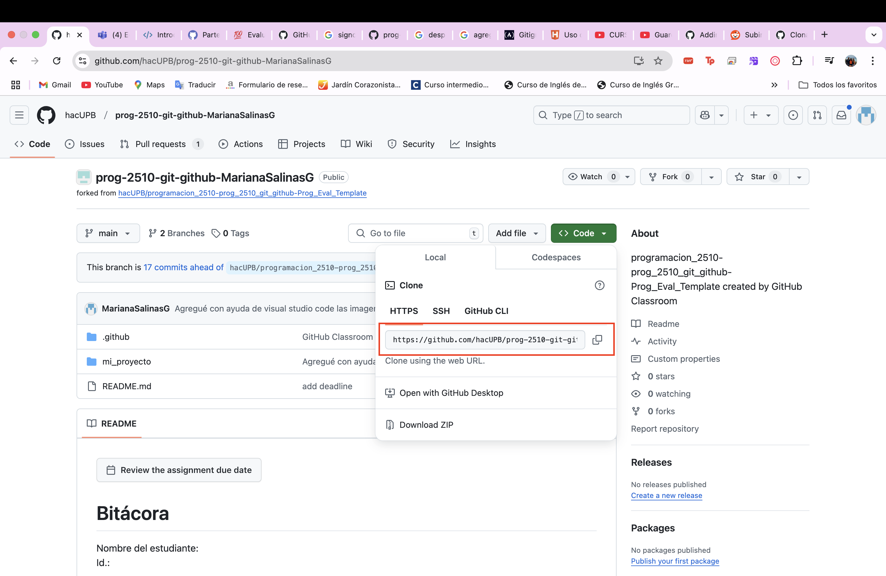

# Bitácora
Nombre del estudiante: Mariana Salinas Gallego

Id.: 000557756

## Descripción del proyecto
Este proyecto se trata de poder afianzar y poner en práctica lo aprendido en clase con ayuda de las plataformas: Git, GitHub, Visual Studio Code y las terminales. 
Evidencia el buen uso de los comandos y pone a prueba nuestras capacidades, lo que hemos aprendido y nos obliga a seguir insistiendo en la ejecución de comandos de este tipo para hacer cosas "básicas" como: crear o eliminar carpetas y repositorios, configurar archivos de texto, entre otros.

## Pasos para clonar y ejecutar un proyecto

Para clonar un repositorio desde la pagina web de debemos dirigirnos al código y presionar el botón verde ``<> Code``, allí podremos copiar la dirección URL de nuestro repositorio.

Después desde la terminal, con el comando ``git clone`` seguido de la URL del repositorio y tocando la tecla enter se ejecuta y se crea el clon local del mismo.

Ahora si deseamos ejecutar el proyecto debemos asegurarnos de tener **Phyton** instalado en nuestro dispositivo y debemos verificar que se encuentre ejecutado en la terminal con ayuda de los comandos ``python3 --version``.
Desde la terminal con los comandos cd debemos dirigirnos hasta el directorio donde está presente el script de Python.

Estando allí debemos utilizar el comando ``python3`` seguido del nombre del archivo de configuración script, así: **``python3 script.py``**.  

Y así es como logramos ejecutar el script o un proyecto que tengamos en nuestro repositorio.

## Tabla de contenido de el proyecto.

- [Carpeta_Docs](docs/)
  - [Repositorio_local](docs/repositorio_local.md)
  - [Repositorio_remoto](docs/repositorio_remoto.md)
  - [Uso_Consola](docs/uso_consola.md)

- [Carpeta_Images](images)

- [Carpeta_src](src)
  - [Codigo_py](src/codigo.py)
- [GitIgnore](.gitignore)

[README](README.md)

